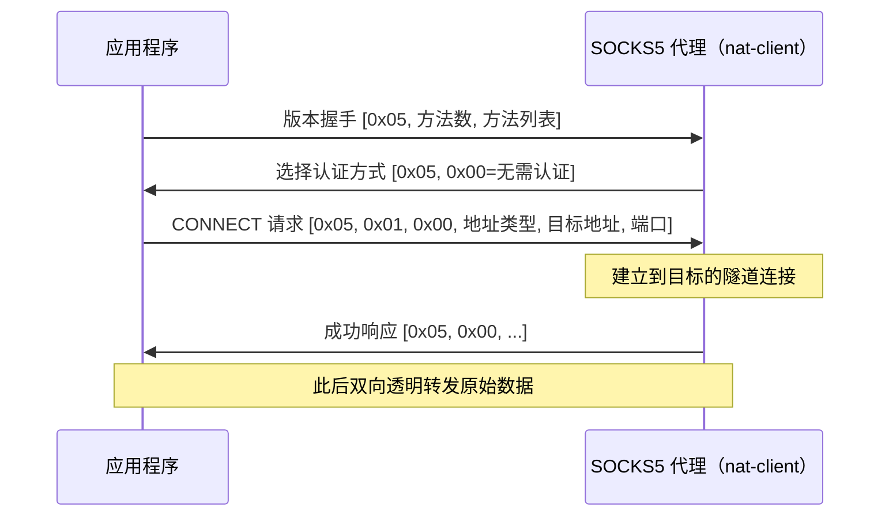
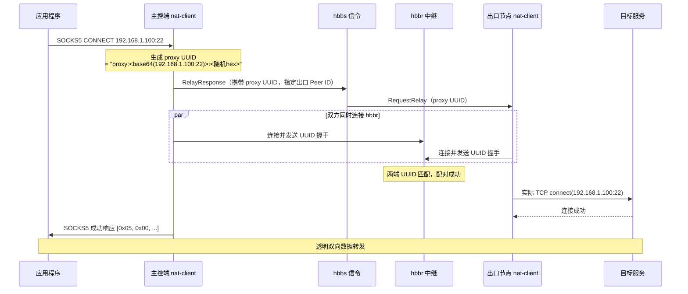
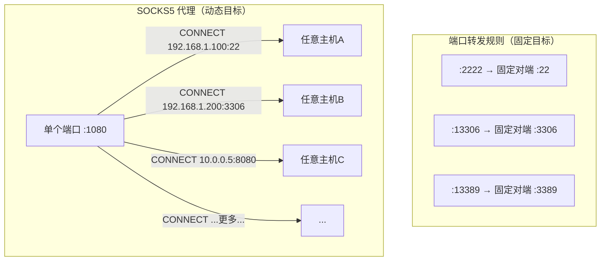
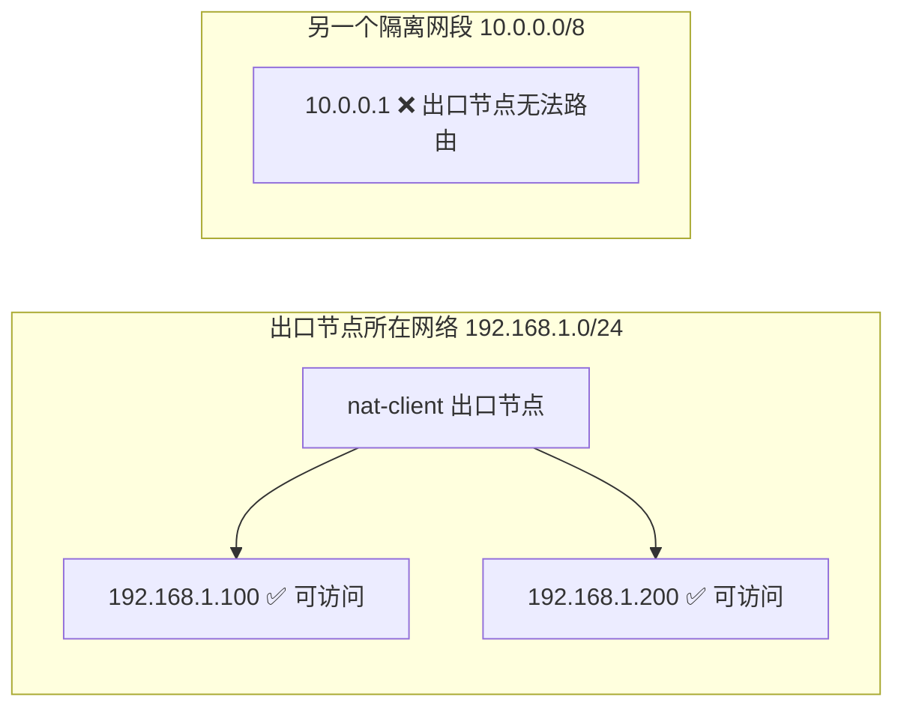

# nat-client SOCKS5 代理模式详解

## 目录

- [什么是 SOCKS5 代理](#什么是-socks5-代理)
- [nat-client 中 SOCKS5 的工作原理](#nat-client-中-socks5-的工作原理)
- [与端口转发规则的区别](#与端口转发规则的区别)
- [配置方式](#配置方式)
- [各类应用的接入方法](#各类应用的接入方法)
- [HTTP CONNECT 代理](#http-connect-代理)
- [注意事项与限制](#注意事项与限制)

---

## 什么是 SOCKS5 代理

SOCKS5（RFC 1928）是一种通用的网络代理协议。与 HTTP 代理不同，它工作在会话层，**对应用层协议完全透明**——无论是 SSH、MySQL、Redis、HTTP 还是任何 TCP 应用，都可以通过同一个 SOCKS5 端口代理出去。

```mermaid
graph LR
    subgraph 无代理：直连失败
        APP1["应用"] -. "无法穿越 NAT" .-> TARGET1["内网目标"]
    end

    subgraph 有 SOCKS5 代理：透明穿透
        APP2["应用\n配置代理:\n127.0.0.1:1080"]
        S5["SOCKS5\n代理服务器"]
        TUN["NAT 穿透隧道"]
        TARGET2["内网目标\n任意 host:port"]
        APP2 -->|"CONNECT host:port"| S5
        S5 --> TUN --> TARGET2
    end
```

应用程序与代理服务器之间的握手流程（RFC 1928）：



---

## nat-client 中 SOCKS5 的工作原理

### 整体架构

```mermaid
graph LR
    subgraph 主控端（本机）
        APP["任意 TCP 应用\nssh / mysql / curl…"]
        S5["nat-client\nSOCKS5 监听\n127.0.0.1:1080"]
        APP -->|"SOCKS5 握手\n告知目标 host:port"| S5
    end

    subgraph nat-server（公网）
        HBBS["hbbs\n信令服务器"]
        HBBR["hbbr\n中继服务器"]
        S5 -->|"① 通知出口节点"| HBBS
        S5 -->|"② 建立中继通道"| HBBR
    end

    subgraph 出口节点（内网或远端）
        EXIT["nat-client\n出口节点\nPeer ID: 382019471"]
        T1["目标 A\n192.168.1.100:22"]
        T2["目标 B\n192.168.1.200:3306"]
        T3["目标 C\n10.0.0.5:8080"]
        EXIT -->|"实际发起 TCP 连接"| T1
        EXIT -->|"实际发起 TCP 连接"| T2
        EXIT -->|"实际发起 TCP 连接"| T3
    end

    HBBS -->|"推送 RequestRelay"| EXIT
    HBBR <-->|"中继双向数据"| EXIT
```

### 连接建立的详细过程



### proxy UUID 的设计

nat-client 使用一种特殊格式的 UUID 来传递目标地址，而**不需要修改 hbbs/hbbr 协议**：

```
proxy:<base64url(host:port)>:<随机hex8>

示例：
  目标: 192.168.1.100:22
  UUID: proxy:MTkyLjE2OC4xLjEwMDoyMg:a3f82c1d
```

出口节点的 `rendezvous_mediator.rs` 收到 `RequestRelay` 后，发现 UUID 以 `proxy:` 开头，便解析出目标地址，直接 TCP connect 到目标，再与 hbbr 配对——整个过程对 hbbs/hbbr 完全透明。

---

## 与端口转发规则的区别

| 对比维度 | 端口转发规则（forward_rules） | SOCKS5 代理 |
|---------|------------------------------|------------|
| **目标** | 固定（配置时确定） | 动态（每次连接时由应用指定） |
| **可访问的目标数** | 一条规则对应一个目标 | 出口节点能访问到的任意主机:端口 |
| **需要在被控端配置** | 是，每个服务添加一条规则 | 否，被控端只需在线 |
| **应用需要感知** | 否，直接连 `127.0.0.1:本地端口` | 是，需要在应用中设置代理地址 |
| **连接方式** | 直连（打洞）或中继 | **始终通过 hbbr 中继** |
| **适合场景** | 固定服务、对延迟敏感 | 临时访问、批量访问内网多台机器 |



---

## 配置方式

### 第一步：确认出口节点在线

出口节点（被控端）只需正常运行 nat-client，**不需要任何额外配置**：

```bash
# 出口节点（内网机器，如树莓派或公司服务器）
nat-client daemon --server nat.example.com

# 查看 Peer ID
nat-client id
# 输出: 382019471
```

### 第二步：在主控端配置文件中启用 SOCKS5

编辑 `~/.config/nat-client/config.toml`（Linux/macOS）或 `%APPDATA%\nat-client\config.toml`（Windows）：

```toml
# 启用 SOCKS5 代理
socks5_enabled   = true
socks5_port      = 1080           # 本地监听端口（默认 1080）
socks5_exit_peer = "382019471"    # 出口节点的 Peer ID
```

### 第三步：重启主控端 nat-client

```bash
# 先停止已有实例（如有）
# 重新启动
nat-client gui --server nat.example.com
# 或
nat-client daemon --server nat.example.com
```

启动成功后日志会显示：
```
[proxy] SOCKS5/HTTP 代理服务器监听 127.0.0.1:1080，出口节点: 382019471
```

---

## 各类应用的接入方法

### 命令行工具

**curl**
```bash
curl --socks5 127.0.0.1:1080 http://192.168.1.100:8080
curl --socks5-hostname 127.0.0.1:1080 https://内网域名.local/api
```

**ssh**
```bash
# 方式一：-o ProxyCommand（nc 需要支持 -x 参数）
ssh -o ProxyCommand="nc -x 127.0.0.1:1080 %h %p" user@192.168.1.100

# 方式二：写入 ~/.ssh/config（永久生效）
Host 内网-*
    ProxyCommand nc -x 127.0.0.1:1080 %h %p

# 之后直接用
ssh user@192.168.1.100
ssh user@192.168.1.200
```

**wget**
```bash
export http_proxy=socks5://127.0.0.1:1080
export https_proxy=socks5://127.0.0.1:1080
wget http://192.168.1.100:8080/file.tar.gz
```

**全局环境变量（所有支持代理的工具）**
```bash
export ALL_PROXY=socks5://127.0.0.1:1080
# 取消代理
unset ALL_PROXY
```

---

### 数据库客户端

**DBeaver**

`数据库` → `新建连接` → 填写内网数据库地址 → `编辑驱动程序设置` → `SSH/代理` → 选择 `SOCKS5` → 填写 `127.0.0.1:1080`

```
主机: 192.168.1.50     ← 内网真实地址（不是 127.0.0.1）
端口: 3306
代理: SOCKS5 127.0.0.1:1080
```

**Navicat**

`连接` → `通用` → 填写内网地址 → `SSH` 标签页（或高级选项）→ 代理类型 `SOCKS5` → `127.0.0.1:1080`

**redis-cli**
```bash
# 通过 tsocks 或 proxychains
proxychains redis-cli -h 192.168.1.60 -p 6379

# 或配置 ALL_PROXY
ALL_PROXY=socks5://127.0.0.1:1080 redis-cli -h 192.168.1.60 -p 6379
```

---

### 浏览器

**Chrome / Edge**（命令行启动，仅对该实例生效）
```bash
# macOS
/Applications/Google\ Chrome.app/Contents/MacOS/Google\ Chrome \
    --proxy-server="socks5://127.0.0.1:1080"

# Windows
"C:\Program Files\Google\Chrome\Application\chrome.exe" \
    --proxy-server="socks5://127.0.0.1:1080"
```

**Firefox**

`设置` → `网络设置` → `手动配置代理` → SOCKS 主机填 `127.0.0.1`，端口 `1080`，选择 `SOCKS v5`，勾选"通过 SOCKS v5 代理 DNS 查询"。

**推荐：使用浏览器插件（更灵活）**

[SwitchyOmega](https://chrome.google.com/webstore/detail/proxy-switchyomega/padekgcemlokbadohgkifijomclgjgif)（Chrome/Edge/Firefox 均支持）：
1. 新建情景模式 → 代理协议 `SOCKS5` → 服务器 `127.0.0.1` → 端口 `1080`
2. 可按域名/IP 规则自动切换代理，内网地址走代理，外网直连

---

### 系统全局代理

**macOS**

`系统偏好设置` → `网络` → 选择当前网卡 → `高级` → `代理` → 勾选 `SOCKS 代理` → 填写 `127.0.0.1` 和 `1080`

```bash
# 或命令行设置（Wi-Fi 接口名视实际情况而定）
networksetup -setsocksfirewallproxy Wi-Fi 127.0.0.1 1080
networksetup -setsocksfirewallproxystate Wi-Fi on

# 取消
networksetup -setsocksfirewallproxystate Wi-Fi off
```

**Windows**

`设置` → `网络和 Internet` → `代理` → 手动代理设置：
```
地址: socks=127.0.0.1:1080
（Windows 系统代理不支持 SOCKS5，建议用 Clash/V2rayN 等工具将 SOCKS5 转为系统可用的代理）
```

> 提示：Windows 系统代理对 SOCKS5 支持有限，推荐搭配 [Proxifier](https://www.proxifier.com/)（商业软件）或 [Netch](https://github.com/netchx/netch)（开源）实现全局 SOCKS5。

**Linux（proxychains-ng）**

```bash
# 安装
sudo apt install proxychains-ng   # Debian/Ubuntu
sudo dnf install proxychains-ng   # Fedora

# 编辑 /etc/proxychains.conf（或 ~/.proxychains/proxychains.conf）
[ProxyList]
socks5  127.0.0.1  1080

# 使用（在任意命令前加 proxychains4）
proxychains4 ssh user@192.168.1.100
proxychains4 curl http://192.168.1.50:8080
proxychains4 python3 my_script.py
```

---

## HTTP CONNECT 代理

nat-client 在同一个端口上同时支持 SOCKS5 和 **HTTP CONNECT** 协议——通过读取首字节自动区分（`0x05` → SOCKS5，其他 → HTTP）。

适用于只支持 HTTP 代理的工具（如某些 Java 应用、老旧工具）：

```toml
# 同样的端口，无需额外配置，HTTP CONNECT 自动生效
http_proxy_enabled = true
http_proxy_port    = 8118    # 也可以单独指定一个端口
socks5_exit_peer   = "382019471"
```

```bash
# 使用 HTTP CONNECT 代理
export http_proxy=http://127.0.0.1:1080
export https_proxy=http://127.0.0.1:1080
curl http://192.168.1.100:8080

# 或单独走 8118 端口
export http_proxy=http://127.0.0.1:8118
```

HTTP CONNECT 与 SOCKS5 的差异：

| | SOCKS5 | HTTP CONNECT |
|-|--------|--------------|
| 支持 UDP | ❌（nat-client 实现中不支持） | ❌ |
| 支持域名 | ✅ | ✅ |
| 支持任意 TCP 协议 | ✅ | ✅（仅 CONNECT 方法） |
| 工具兼容性 | 大多数现代工具 | 几乎所有 HTTP 感知工具 |

---

## 注意事项与限制

### 1. 始终通过 hbbr 中继

与端口转发规则（可以打洞直连）不同，SOCKS5 代理**所有连接都经过 hbbr 中继**，不会尝试 P2P 打洞。

原因：每次 SOCKS5 连接的目标都是动态的（由应用实时告知），无法提前协商打洞。


**影响**：延迟比打洞直连略高（多一跳服务器），带宽受 hbbr 服务器带宽限制。

### 2. 仅支持 TCP（不支持 UDP）

SOCKS5 协议支持 UDP ASSOCIATE 命令，但 nat-client 当前实现**只支持 CONNECT（TCP）**，不支持 UDP 代理。

受影响的应用：
- DNS 查询（UDP 53）：需要配合 DNS-over-TCP 或 DNS-over-HTTPS
- 游戏（多数使用 UDP）：无法代理
- 视频会议（WebRTC/QUIC）：无法代理

### 3. 无用户名/密码认证

当前实现只支持 **NoAuth（无认证）**，任何能连接到 `127.0.0.1:1080` 的本地进程都可以使用代理。

由于监听地址固定为 `127.0.0.1`（localhost），无法被其他机器访问，安全性在单机使用场景下是足够的。

### 4. 出口节点能访问的范围即代理的范围

出口节点（`socks5_exit_peer`）能 TCP connect 到哪里，代理就能访问到哪里。



如果内网有多个隔离网段，需要在每个网段分别部署出口节点，并分别配置或切换 `socks5_exit_peer`。

### 5. 监听地址固定为 127.0.0.1

代理服务只监听本机回环地址，**不能**被局域网中其他机器使用。如果需要给局域网内其他设备提供代理，需要在路由器或共享主机上运行专用代理软件（如 Clash），将 SOCKS5 转发到外部地址。

---

## 快速参考

```bash
# 验证 SOCKS5 代理是否正常工作
curl --socks5 127.0.0.1:1080 http://httpbin.org/ip
# 若返回的 IP 是出口节点的公网 IP，则代理正常

# 验证能否访问内网目标
curl --socks5 127.0.0.1:1080 http://192.168.1.100:8080
```

```toml
# ~/.config/nat-client/config.toml 最简配置
rendezvous_servers = "nat.example.com"
socks5_enabled     = true
socks5_port        = 1080
socks5_exit_peer   = "382019471"   # 替换为实际出口节点 Peer ID
```
