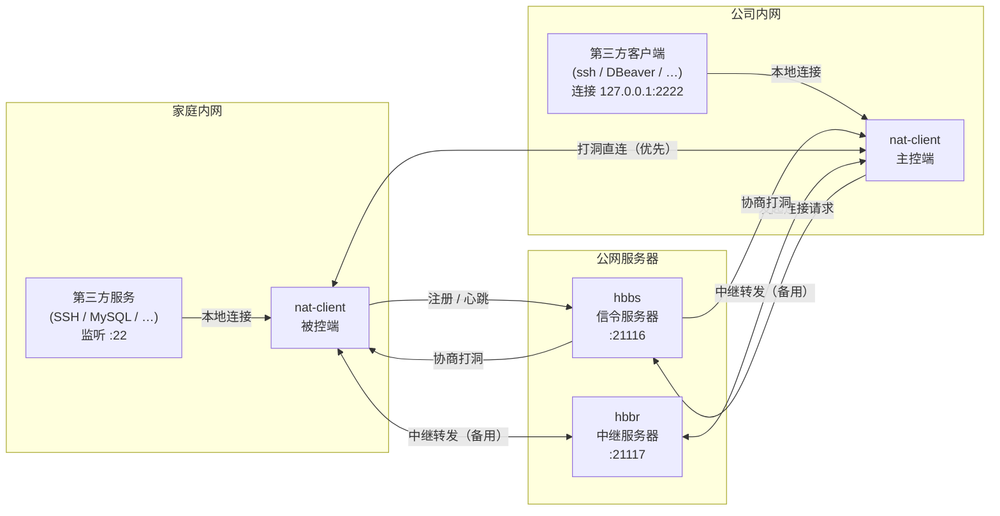
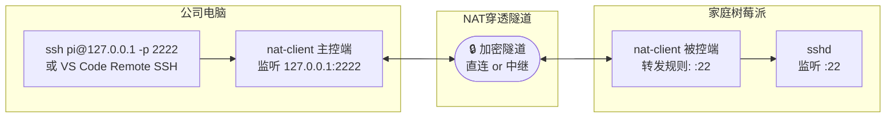
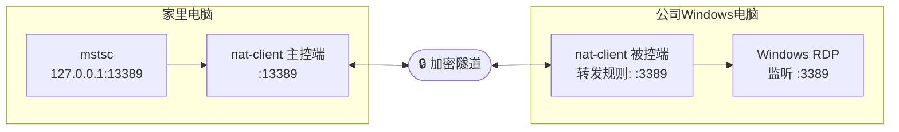
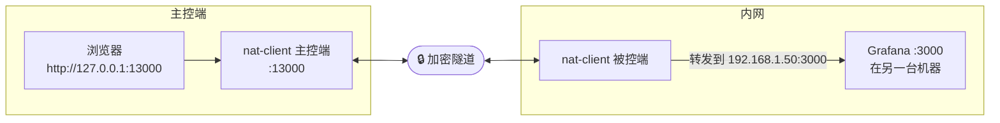
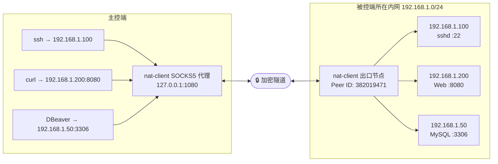
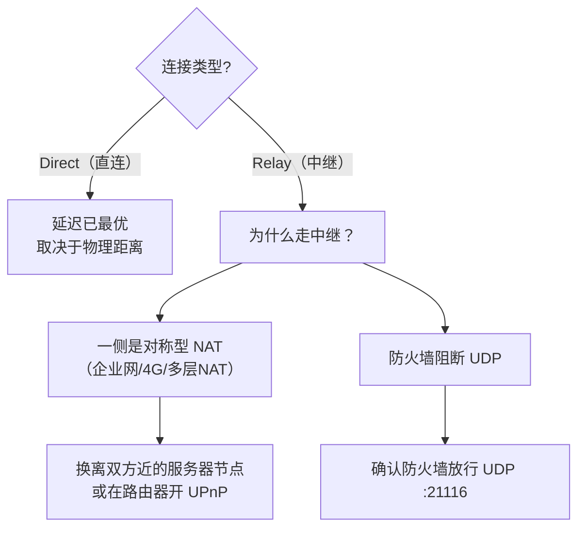

# nat-client 内网穿透接入指南

本文通过具体场景举例，说明如何让第三方应用（SSH、远程桌面、数据库、Web 服务等）借助 nat-client 穿透 NAT 实现远程访问。

---

## 基本原理

nat-client 的穿透机制对第三方应用**完全透明**——应用程序感知不到隧道的存在，只需连接 `127.0.0.1:本地端口` 即可。



**两端操作分工：**

| 角色 | 操作 | 说明 |
|------|------|------|
| **被控端**（有服务的机器） | 启动 nat-client + 配置转发规则 | 告诉 nat-client"对端连入时把流量转给哪个本地服务" |
| **主控端**（要访问的机器） | `nat-client connect` | 在本机开一个本地端口，连上它就等于连上被控端的服务 |

### 连接建立时序

```mermaid
sequenceDiagram
    participant A as 主控端
    participant S as hbbs（信令）
    participant R as hbbr（中继）
    participant B as 被控端

    A->>S: PunchHoleRequest（目标 Peer ID）
    S->>B: PunchHole（主控端地址）
    S->>A: PunchHoleResponse（被控端地址）

    par 尝试打洞
        A-->>B: TCP SYN（打洞）
        B-->>A: TCP SYN（打洞）
    end

    alt 打洞成功
        A<-->B: 直连隧道（P2P）
    else 打洞失败（对称NAT等）
        A->>R: 连接中继
        B->>R: 连接中继
        A<-->R<-->B: 中继隧道
    end

    Note over A,B: 隧道建立后，第三方应用透明接入
```

---

## 场景一：SSH 远程登录

**目标**：在公司电脑通过 SSH 访问家里树莓派。



### 被控端（树莓派，家庭内网）

**第一步**：启动 nat-client 守护进程

```bash
nat-client daemon --server nat.example.com
```

**第二步**：添加 SSH 转发规则（只需做一次，保存在配置文件中）

```bash
nat-client add-rule -n SSH -t 22
```

等价于在 `~/.config/nat-client/config.toml` 中写入：

```toml
[[forward_rules]]
name        = "SSH"
peer_id     = ""          # 空 = 允许任意已认证对端连入
target_host = "127.0.0.1"
target_port = 22
enabled     = true
```

**第三步**：确认在线

```bash
nat-client id       # 记下 Peer ID，例如：382019471
nat-client status   # 显示 Online
```

### 主控端（公司电脑）

**第一步**：建立隧道

```bash
# 将树莓派的 :22 映射到本机 :2222
nat-client connect --peer-id 382019471 --local-port 2222
```

输出示例：
```
[mediator] 直连模式（打洞成功）: 182.xx.xx.xx:45231
[port_forward] 本地监听: 127.0.0.1:2222
隧道已建立，本地端口: 2222
```

**第二步**：用任意 SSH 客户端连接

```bash
# 命令行
ssh pi@127.0.0.1 -p 2222

# VS Code Remote SSH（~/.ssh/config）
Host raspi-tunnel
    HostName 127.0.0.1
    Port 2222
    User pi
    IdentityFile ~/.ssh/id_rsa

# Tabby / MobaXterm / PuTTY
# 主机: 127.0.0.1  端口: 2222  用户: pi
```

---

## 场景二：远程桌面（Windows RDP）

**目标**：在家访问公司 Windows 电脑桌面。



### 被控端（公司 Windows 电脑）

```bash
# 确保系统已开启远程桌面（设置 → 系统 → 远程桌面 → 启用）

# 启动 nat-client（Windows GUI 模式）
nat-client gui --server nat.example.com

# 添加 RDP 转发规则
nat-client add-rule -n RDP -t 3389
```

记下 Peer ID，例如：`560341892`

### 主控端（家里的电脑）

```bash
nat-client connect --peer-id 560341892 --local-port 13389
```

打开"远程桌面连接"（mstsc），输入 `127.0.0.1:13389`：

```bash
# 或命令行直接打开
mstsc /v:127.0.0.1:13389
```

> **注意**：RDP 对延迟敏感，建议服务器选择离双方都近的节点，打洞直连时体验最佳。

---

## 场景三：数据库远程访问

**目标**：用 DBeaver / Navicat 连接开发机上的 MySQL。

```mermaid
graph LR
    subgraph 主控端
        DB_CLIENT["DBeaver / Navicat\n主机: 127.0.0.1\n端口: 13306"]
        MCC3["nat-client 主控端\n:13306"]
        DB_CLIENT --> MCC3
    end

    TUN3(["🔒 加密隧道\n（peer_id 白名单验证）"])

    subgraph 开发机（内网）
        BCB3["nat-client 被控端\n转发规则: :3306\npeer_id=123456789"]
        MYSQL["MySQL\n监听 127.0.0.1:3306"]
        BCB3 --> MYSQL
    end

    MCC3 <--> TUN3 <--> BCB3
```

### 被控端（开发机）

```bash
nat-client daemon --server nat.example.com

# 添加 MySQL 规则，仅允许指定 Peer ID 的主控端连入（更安全）
nat-client add-rule -n MySQL -t 3306 --peer-id 123456789
```

配置效果：

```toml
[[forward_rules]]
name        = "MySQL"
peer_id     = "123456789"   # 只允许这一个 Peer 连入
target_host = "127.0.0.1"
target_port = 3306
enabled     = true
```

### 主控端

```bash
nat-client connect --peer-id <开发机ID> --local-port 13306
```

在 DBeaver / Navicat 中新建连接：

```
主机: 127.0.0.1
端口: 13306
用户名: root
密码: xxxxxx
```

**其他数据库端口参考**

| 数据库 | 默认端口 | 规则示例 |
|--------|---------|----------|
| MySQL | 3306 | `add-rule -n MySQL -t 3306` |
| PostgreSQL | 5432 | `add-rule -n PgSQL -t 5432` |
| Redis | 6379 | `add-rule -n Redis -t 6379` |
| MongoDB | 27017 | `add-rule -n MongoDB -t 27017` |
| SQL Server | 1433 | `add-rule -n MSSQL -t 1433` |

---

## 场景四：访问内网 Web 服务

**目标**：访问内网机器上的 Grafana、Jupyter、内部系统等 Web 服务。



如果要暴露**被控端所在内网的另一台机器**上的服务（跨机转发），需手动编辑配置文件：

```toml
# ~/.config/nat-client/config.toml（被控端）

# 访问被控端自身的服务
[[forward_rules]]
name        = "Jupyter"
target_host = "127.0.0.1"
target_port = 8888
enabled     = true

# 访问内网另一台机器的 Grafana
[[forward_rules]]
name        = "Grafana-内网"
target_host = "192.168.1.50"   # 内网另一台机器的 IP
target_port = 3000
enabled     = true

# 访问内网的 Jenkins CI
[[forward_rules]]
name        = "Jenkins"
target_host = "192.168.1.100"
target_port = 8080
enabled     = true
```

### 主控端

```bash
nat-client connect --peer-id <被控端ID> --local-port 13000   # Grafana
nat-client connect --peer-id <被控端ID> --local-port 18888   # Jupyter
nat-client connect --peer-id <被控端ID> --local-port 18080   # Jenkins
```

浏览器分别访问：
- `http://127.0.0.1:13000` → Grafana
- `http://127.0.0.1:18888` → Jupyter
- `http://127.0.0.1:18080` → Jenkins

---

## 场景五：多服务同时暴露

一台被控端可以配置多条规则，主控端分别建立隧道。

```mermaid
graph TB
    subgraph 被控端（单台机器）
        BC5["nat-client 被控端\nPeer ID: 382019471"]
        SSH5["SSH :22"]
        HTTP5["Nginx :80"]
        DB5["MySQL :3306"]
        BC5 --> SSH5
        BC5 --> HTTP5
        BC5 --> DB5
    end

    TUN5(["🔒 加密隧道"])

    subgraph 主控端
        MC5A["隧道 A → :2222\nssh user@127.0.0.1 -p 2222"]
        MC5B["隧道 B → :18080\nhttp://127.0.0.1:18080"]
        MC5C["隧道 C → :13306\nDBeaver → 127.0.0.1:13306"]
    end

    BC5 <--> TUN5
    TUN5 <--> MC5A
    TUN5 <--> MC5B
    TUN5 <--> MC5C
```

### 被控端（一次性配置）

```bash
nat-client add-rule -n SSH   -t 22
nat-client add-rule -n HTTP  -t 80
nat-client add-rule -n HTTPS -t 443
nat-client add-rule -n MySQL -t 3306 --peer-id 123456789
```

### 主控端（每个服务各开一个终端）

```bash
nat-client connect --peer-id 382019471 --local-port 2222    # SSH
nat-client connect --peer-id 382019471 --local-port 18080   # HTTP
nat-client connect --peer-id 382019471 --local-port 13306   # MySQL
```

---

## 场景六：SOCKS5 代理——访问整个内网段

当需要访问被控端所在内网的**多台机器**时，可以启用 SOCKS5 代理模式，无需逐条配置转发规则。



### 被控端（无需额外配置，只要在线即可）

```bash
nat-client daemon --server nat.example.com
# Peer ID: 382019471
```

### 主控端配置

```toml
# ~/.config/nat-client/config.toml
socks5_enabled   = true
socks5_port      = 1080
socks5_exit_peer = "382019471"   # 流量从这台被控端的网络出去
```

重启后使用：

```bash
# SSH 到内网任意机器（ProxyCommand 走 SOCKS5）
ssh -o ProxyCommand="nc -x 127.0.0.1:1080 %h %p" user@192.168.1.100

# curl 访问内网 Web
curl --socks5 127.0.0.1:1080 http://192.168.1.200:8080

# 设置全局环境变量（所有支持 SOCKS5 的命令行工具生效）
export ALL_PROXY=socks5://127.0.0.1:1080
```

也可在系统或浏览器中设置代理：
- **Chrome / Firefox**：设置 → 代理 → SOCKS5 → `127.0.0.1:1080`
- **macOS**：系统偏好设置 → 网络 → 代理 → SOCKS 代理
- **Windows**：设置 → 网络和 Internet → 代理 → 手动代理 → `127.0.0.1:1080`

### HTTP CONNECT 代理（适用于只支持 HTTP 代理的工具）

```toml
http_proxy_enabled = true
http_proxy_port    = 8118
socks5_exit_peer   = "382019471"   # 共用出口节点
```

```bash
export http_proxy=http://127.0.0.1:8118
export https_proxy=http://127.0.0.1:8118
curl http://192.168.1.200:8080
```

---

## 常见问题

### 连接后访问失败（Connection refused）

原因：被控端的转发规则配置了端口，但该端口上没有服务在监听。

```bash
# 快速检查常用端口（约 200ms）
nat-client scan-services

# 全量扫描所有端口，含进程名（推荐用于排查非标准端口）
nat-client scan-services --all
```

### 速度慢、延迟高

```bash
# 查看当前连接类型
nat-client connections
# 输出中 类型:Relay 表示走中继，类型:Direct 表示打洞直连
```



### peer_id 白名单不生效

`peer_id` 字段限定的是**在服务器上注册的 Peer ID**，对端需要登录且设备已绑定账号。若对端未登录，连接会因找不到匹配规则而被拒绝。

### 隧道断开后自动重连

`nat-client connect` 是一次性隧道，被控端重启后需重新执行。可以用脚本保活：

```bash
# Linux / macOS 保活脚本
while true; do
    nat-client connect --peer-id 382019471 --local-port 2222
    echo "$(date) 隧道断开，5 秒后重连..."
    sleep 5
done
```

```powershell
# Windows PowerShell 保活脚本
while ($true) {
    nat-client connect --peer-id 382019471 --local-port 2222
    Write-Host "$(Get-Date) 隧道断开，5 秒后重连..."
    Start-Sleep 5
}
```

---

## 端口映射速查表

| 场景 | 被控端 `target_port` | 主控端 `local-port` | 第三方应用连接地址 |
|------|---------------------|--------------------|--------------------|
| SSH | 22 | 2222 | `ssh user@127.0.0.1 -p 2222` |
| RDP 远程桌面 | 3389 | 13389 | mstsc → `127.0.0.1:13389` |
| VNC | 5900 | 15900 | VNC客户端 → `127.0.0.1:15900` |
| HTTP | 80 | 18080 | `http://127.0.0.1:18080` |
| HTTPS | 443 | 18443 | `https://127.0.0.1:18443` |
| MySQL | 3306 | 13306 | DBeaver → `127.0.0.1:13306` |
| PostgreSQL | 5432 | 15432 | Navicat → `127.0.0.1:15432` |
| Redis | 6379 | 16379 | RDM → `127.0.0.1:16379` |
| MongoDB | 27017 | 27018 | Compass → `127.0.0.1:27018` |
| Jupyter Notebook | 8888 | 18888 | 浏览器 → `http://127.0.0.1:18888` |
| Grafana | 3000 | 13000 | 浏览器 → `http://127.0.0.1:13000` |
| Jenkins | 8080 | 18080 | 浏览器 → `http://127.0.0.1:18080` |
